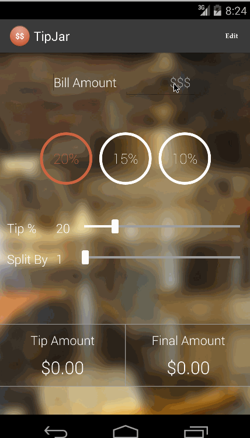

# TipJar

**Tip Calculator utility app which allows a user to calculate the appropriate tip based on the total amount entered.**

Total Hours = 20+ hours spent in total
### Features
1. [x] User is displayed the tip of specified percentage for specified entered amount
2. [x] User enters the total amount of the transaction
3. [x] User can select between tip amounts (i.e 10%, 15%, 20%) 
 * Use Radio Group and experiment with Shapes and selectors to have circle RadioButtons
4. [x] Upon selecting tip amount, formatted tip value is displayed 
5. [x] *Optional:* User changes the total amount and updated tip is reflected automatically
6. [x] *Optional:* User can select custom tip percentage if desired 
 * SeekBar and shapes/selectors to design the Progress Bar and the Thumb
7. [x] *Optional:* User can select how many ways to split the tip 
 * SeekBar and shapes/selectors to design the Progress Bar and the Thumb
8. [x] *Optional:* User can edit preset tip percentages and have them persist across launches 
 * Use Custom Dialog Fragment to edit the tip percentages
 * Use Shared Preferences to persist and load the values across launches
9. [x] *Optional:* Experiment with trying input widgets to replace the buttons and/or textviews
 * RadioButtons and SeekBars
10. [x] *Optional:* Improve the user interface and experience by using images and/or colors
11. [x] *Additional:* Location the city of the current restaurant and find the sales tax of the city. 
 * Tax tables for various cities is stored in res/xml directory in Xmlformat.
 * Persist the preset tip amounts across launches using SharedPrefernces
 * Use GPS and Geocoder to determine the name of the city
 * :exclamation: Please see attached *images* for screenshot since geocoder requires a backend service that is not present on the emulator.
12. [x] *Additional:* Compute PreTax Amount and Tip on that based on the city
13. [ ] *Additional:* Change shape of circles into polygons( explore canvas )
14. [ ] *Additional:* Get the name of the restaurant and persist tips/amount and obtain a history for a restaurant
15. [ ] *Additional:* Search tip history for a specific restaurant
16. [ ] *Additional:* Show tipping etiquette information from itipping.com

### Exploration of Topics
1. Customization of UI  using themes and styles.
2. Creating effects with Shape Drawable, StateListDrawable
3. SeekBar , Radio Button Control
4. TextWatcher
5. Background images - Opacity , Scaling etc
6. GPS related
7. using xml resources in map format.
8. Use Android Lint (Addressed one performance issue - Move background image to styling instead of in the activity - overdrawn issue)
9. Wire framing using FluidUI
10. Async Task

### Walk through of all user stories:

The background image is from Ghirardelli Square ,chocolate making process during one of my trips. The place was
granted the National Historic Register Status in 1982.
The image does not show well on Licecap.

GIF created with [LiceCap](http://www.cockos.com/licecap/).
<figure>

<figcaption> Full Amount, service Tax included
</figure>
 
<figure>

<figcaption>Pre Tax amount, Tax determine from location
</figure>
 

